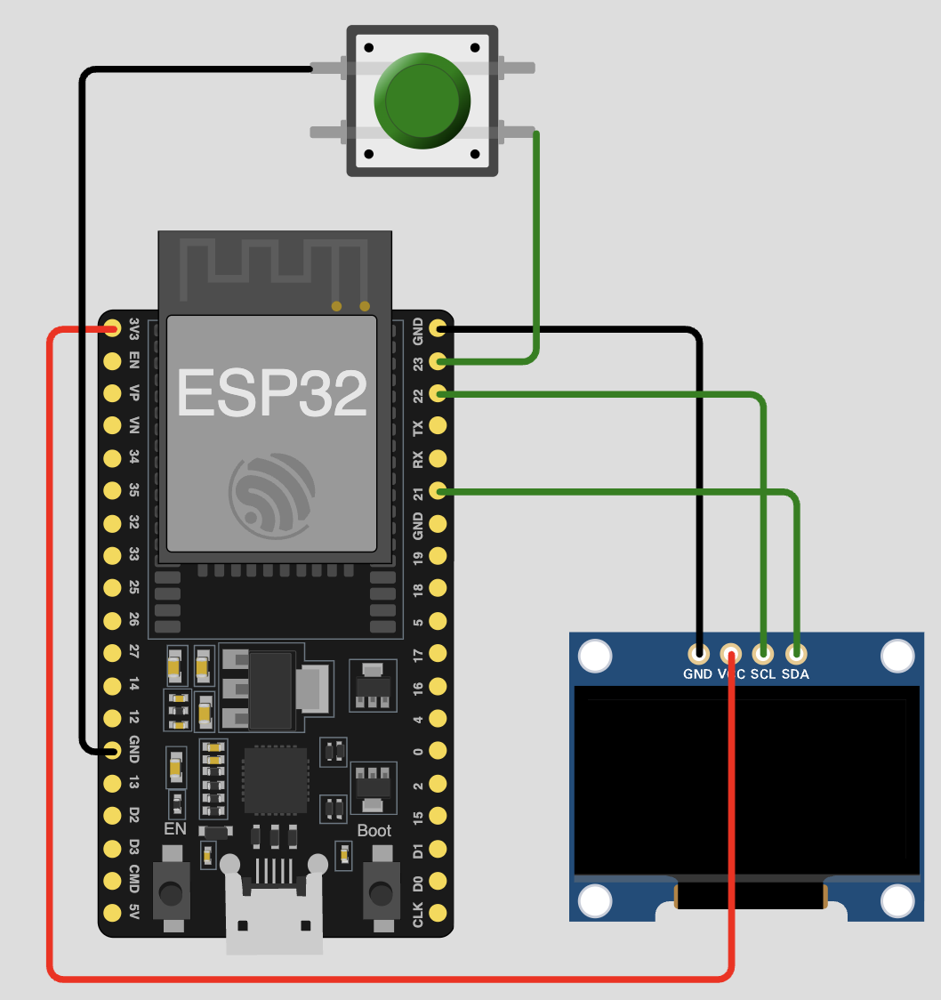

# Morse-Decoder - **School Project** #

We made a Morse Decoder with a tool that helped us to create 
the Code and the first Prototype in [WOKWi](https://wokwi.com/esp32).
It works like this:
1. You press the button for a short time like less than 200ms, it will decode it as a dot (.)
2. You press the button for a long time like more than 201ms, it will decode it as a dash (-)
3. If you press the button for like 3 seconds, it will clear the display and reset the morse code

### What is WOKWi? ###
---
- WOKWi is a Website where you can Emulate ESP32 stuff, cable management and use code and libraries that you also need in a real project.
- It use real libraries and the latest ones too.
- WOKWi is also free and as far as i now, about components, there is no limit, but there are different plans where you can pay for it and in example get some more resources to compile the code.

# Steps #
1. Created a concept of the idea of the Morse-Decoder
2. Created the first prototype in WOKWi with 1 Display (SSD1306 OLED Display with I2C) and a Button.
3. Created the code for the prototype
   1. We got some help from some AI tools to create the code and changed it a bit to fit my needs
   2. We used the latest libaries from WOKWi, so i didn't have to download them
4. Tested the code in WOKWi and changed values so that it would work
   1. very important is the time where you press and release the button, so that it can decode the morse code correctly
5. Created the final code for the real prototype 
6. Tested the code on a real ESP32 with a SSD1306 OLED Display and a Button
7. Created the README.md file as a documentation for the project
8. Created the GitHub repository and uploaded the code

## Prototype from Wokwi ##


## Featues ##
- Decode Morse Code from a Button
- Show the decoded Morse Code on a SSD1306 OLED Display

## Problmes that we had while creating the code ##
- Accidentally used the wrong lib, we used a **old/wrong** one: 
```
#include <Adafruit_GFX.h>
#include <Adafruit_SSD1306.h>
```

